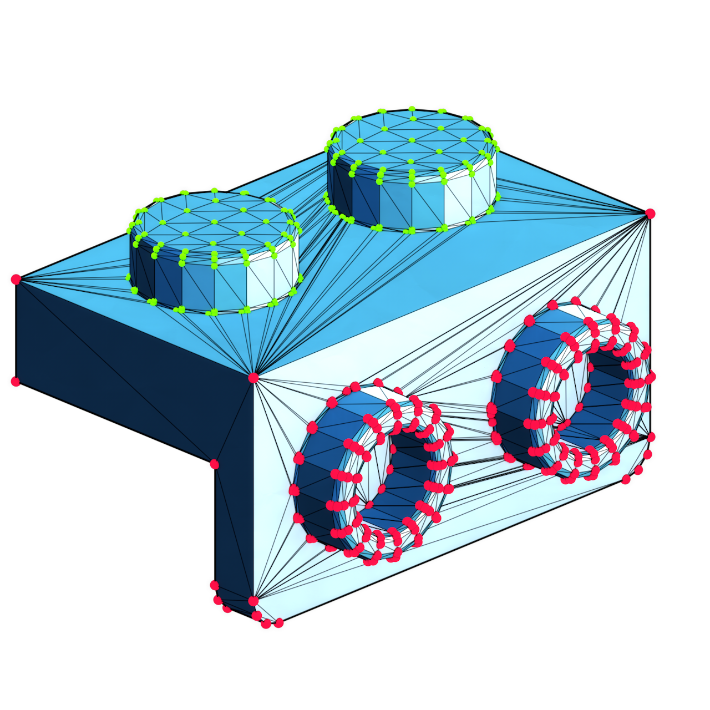
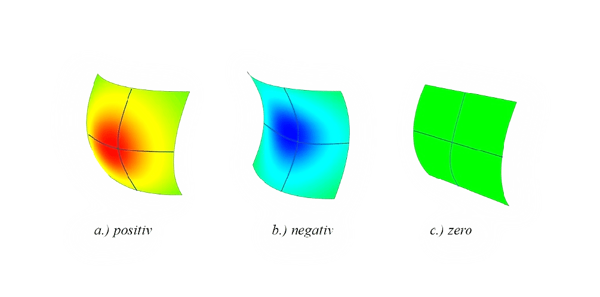
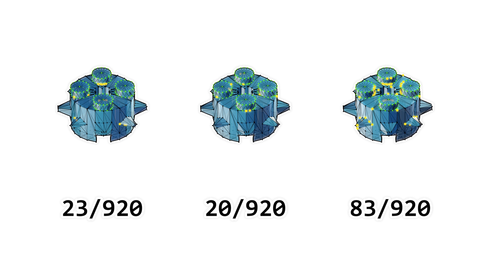
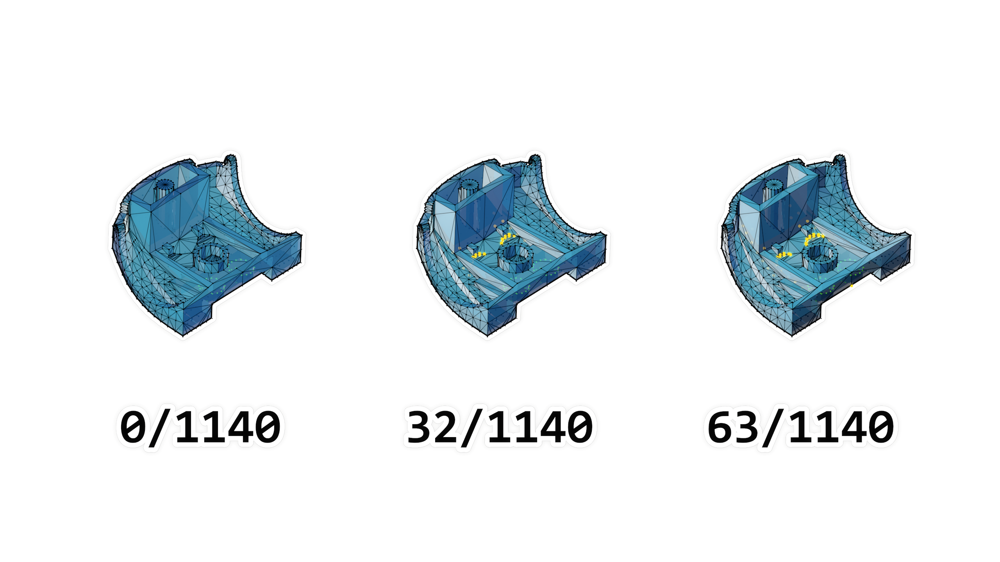
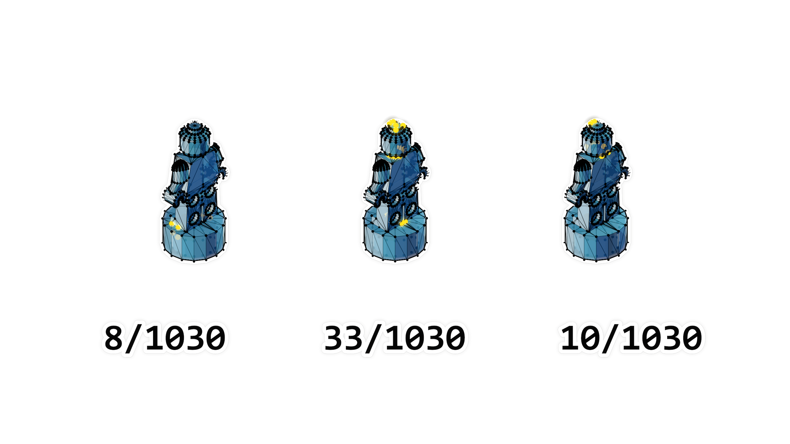
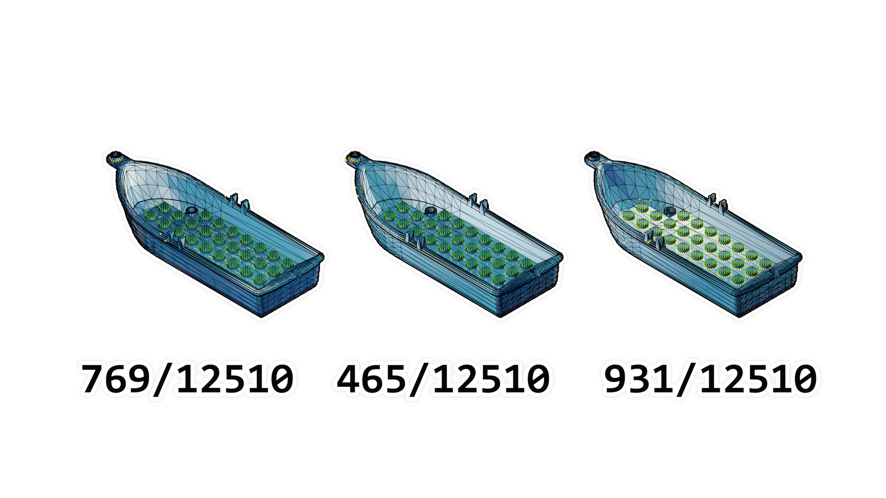

# ProyectoGCNN

Descarga las dos carpetas de datos de entrenamiento y prueba:
https://sadami.ddns.net/nextcloud/s/ProyectoCGNN

# Redes Neuronales Convolucionales en Grafos

## Proyecto realizado para la materia: Cómputo conexionista
José Miguel Medina Pérez.\
*Nota: Se recomienda usar un tema obscuro para visualizar este cuaderno*

En este trabajo se presenta la implementación de una red neuronal para la segmentación de vértices en una mall 3D usando pytorch, definiendo una capa personalizada con la operación de convolución en grafos descrita en el  artículo: *Semi-supervised Classification with Graph Convolutional Networks* disponible en: <https://arxiv.org/abs/1609.02907> 

## Representación de una estructura 3D como un grafo

Uno de los usos frecuentes del deep learning en grafos es el procesamiento de objetos tridimensionales basados en polígonos (mallas o superficies 3D), en este proyecto se presenta un caso particular en el cual los datos de entrada corresponden a objetos poligonales que modelan piezas de juguetes de construcción, en donde cada vértice pertenece a una de dos clases posibles: Stud (1) y No Stud (0), en donde los vértices "Stud" son aquellos que pertenecen a una estructura cilíndrica que permite que las piezas se interconecten entre sí.

En la figura 2.1 se puede observar un ejemplo con una pieza básica, los nodos Stud están marcados con verde y los No Stud con Magenta.

<figcaption align='center'> Figura 2.1- Superficie poligonal / nodos: Stud (verde) nodos: No Stud (magenta) </figcaption>

De esta manera, se puede encontrar de manera directa una representación del objeto mediante un grafo, en el cual cada nodo representa un vértice del objeto poligonal y cada arista representa una arista del objeto poligonal. Adicionalmente los nodos pueden contener información mediante una función $f$.

Los objetos poligonales para formar la base de datos fueron descargados del sitio <www.mecabricks.com> y posteriormente procesados usando el software de animación Cinema 4D para obtener una única malla por cada pieza, ya que los archivos orginiales contienen distintas "islas de polígonos", es decir, multiples mallas poligonales forman parte del mismo objeto. La diferencia entre las piezas procesadas y no procesadas se puede observar en la figura 2.2.

<figcaption align='center'> Figura 2.3 Objeto original con cuatro islas poligonales/ malla procesada (todos los polígonos forman parte del mismo objeto) </figcaption>

Teniendo esto en mente, todas las mallas procesadas en el conjunto de datos cuentan con las mismas características:

* No contienen islas poligonales ni aristas, puntos o polígonos aislados.
* Están compuestas por triángulos (son mallas triangulares).

En la figura 2.3 se muestran 8 piezas cuya malla ha sido procesada y etiquetada, es importante observar que losvértices etiquetados como Stud (los puntos verdes) son muy similares a otras estructuras cilíndricas que no corresponden a esa misma clase, y la diferencia principal es cómo se relacionan con el resto de vértices de la misma pieza.

<figcaption align='center'> Figura 2.3 - Mallas procesadas y etiquetadas en dos clases </figcaption>

Se obtuvieron y procesaron 237 piezas diferentes, de las cuales se generaron 5 archivos por cada una de ellas con formato 'csv' con la siguiente información:

* Nombre_edges.csv: Contiene todas las aristas del grafo, una en cada fila.
* Nombre_features.csv: Contiene las características de cada nodo (vértice) en donde cada columna es un nodo y cada fila es una característica.
* Nombre_target.csv: Contiene la etiqueta de cada nodo, en donde cada columna es un nodo. 
* Nombre_coords.csv: Contiene las coordenadas de cada vértice, en donde el número de fila representa el id del vértice.

En este caso, se consideraron $9$ características $f$ para cada vértice $i$ en la malla:

* Curvatura Gaussiana
* Ángulo de apertura de los vecinos (normalizado con el módulo)
* Ángulo de apertura de los vecinos (normalizado con el máximo)
* Relación entre el vecino más cercano y el más lejano
* Distancia normalizada al centro de masa
* Ángulo promedio al vector normal unitario
* La desviación estándar normalizada de la distancia a los vecinos
* La relación entre el tamaño del perímetro de los vecinos y la máxima distancia a uno de ellos
* El promedio de la proyección del vector normal de polígonos vecinos al centro de masa

## $f_1$: Curvatura Gaussiana

La curvatura gaussiana $k_g$ de una malla triangular se puede calcular para cada vértice $v_i$ como:

$$
k_i = \frac{2\pi - \sum\theta_j}{A_i}
$$

En donde el ángulo de apertura $\theta_j$ representa el ángulo formado en el vértice $i$ dado el triángulo $j$: 

y el área $A_j$ se define como:

$$
A_i = \frac{1}{3}\sum_{T_j\in\mathcal{N}(i)}area(T_j)
$$

En donde $T_j$ son los triángulos que tienen a $i$ como vértice y $\mathcal{N}(i)$ son los vértices del vecindario directo (adyacentes) del vértice $i$, también llamados vecinos de $i$.

La curvatura Gaussiana representa la forma que tiene la superficie alrededor del vértice $i$, si es positiva, el resto de los vecinos forman una estructura de tipo "bowl" (es un punto elíptico), si es negativa, la estructura tiene forma de "silla de montar" (es un punto hiperbólico), y si es cero, la superficie es plana en al menos una dirección (es un punto parabólico).

Nótese que este valor depende de la escala de la malla (según el área de los triángulos), por lo que no es una propiedad invarainte a la escala, sin embargo, para evitar la variabilidad entre polígonos grandes y pequeños, se puede considerar únicamente el signo. Para ello se asigna un valor de $0.5$ si la curvatura es $0$, $0$ si es negativa y $1$ si es positiva, teniendo un rango de  $f_1(i)\in{0,0.5,1}$.

*fuente:* http://rodolphe-vaillant.fr/entry/33/curvature-of-a-triangle-mesh-definition-and-computation

## $f_2,f_3$ : Ángulo de apertura

El ángulo de paertura previamente definido es útil para concer el aspecto que tienen los triángulos adyacentes al vértice $i$, por lo que se propone usarlo como otra característica, sin embargo, hay dos formas de normalizar este valor:

* Usando el operador "Móulo": $$O_i = 2\pi - mod(\sum_{j\in\mathcal{N}(i)}\theta_j,\pi)$$ Es una manera de saber cuántos grados hacen falta para completar una vuelta de 360° usando todos los ángulos de apertura, y reiniciando a cero cad vez que una vuelta es completada. Para normalizar de $0$ a $1$ se puede dividir entre $2\pi$, por lo que el rango de esta característica es $\mathbf{0 <= f_2(i) <= 1}$.

* Usando el ángulo de apertura máximo y el número de triángulos vecinos: $$ \hat{O_i} = \frac{\sum_{j\in\mathcal{N}(i)}\theta_j }{|\mathcal{N}(i)|\pi}  $$ Considerando que un triángulo con área cero y puntos colineales puede tener un ángulo de apertura máximo de $\pi$, y hay $|\mathcal{N}(i)|$ triángulos en el vecindario $\mathcal{N}(i)$, esta característica tiene un rango de $\mathbf{0 <= f_3(i) <= 1}$.

## $f_4$: Rango de la distancia a los vecinos

El rango de distancia normalizada del vecindario es la diferencia entre la distancia mínima y la máxima de un vecino  $j\in\mathcal{N}(i)$ al vértice $i$, está definida como:

$$R_v{_i} = \frac{max(d_i)-min(d_i)}{max_di}$$

$$\text{for } d_i = [dist_{v_i,u_1},dist_{v_i,u_2},...,dist_{i, u_j = |\in\mathcal{N}(i)|}]$$

En donde $dist$ representa la distancia euclidea en un espacio 3D, y está definida como:

$$dist_{v_i,u_j} = \sqrt{(v_{i_x} - u_{j_x})^{2}+(v_{i_y }- u_{j_y})^{2}+(v_{i_z} - u_{j_z})^{2}}$$

Cuando la distancia mínima y la máxima son la misma $d_s$, todos los vecinos viven en la esfera 3D de radio $d_s$ y el rango del vecindario es $0$, y al estar dividido entre la distancia máxima que puede haber, si la distancia mínima es $0$ entonces el rango es de $1$, por lo que esta característica tiene un rango de  $\mathbf{0 <= f_4(i) <= 1}$.

## $f_5$: Distancia normalizada al centro de masa 

El centro de masa (o centroide) puede ser interpretado como el promedio de los valores de los vértices en el vecindario $u_j \in\mathcal{N}(i)$, en este caso respecto a las coordenadas $x,y,z$. 

El centroide se puede calcular como:

$$C_{i} = \frac{\sum_{j\in \mathcal{N}(i)}u_j}{|\mathcal{N}(i)|}$$

Y la distancia ($DC$) del vértice $v_i$ al centroide $C_i$ se puede calcular usando la fórmula previa de distancia euclídea: $$DC = dist_{v_i,C_i}$$

Este valor por sí mismo no es invariante a la escala, ya que crece proporcionalmente al objeto, sin embargo,puede ser normalizada dividiendo entre la distancia máxima a un vecino:

$$\hat{DC_{i}} = \frac{dist_{v_i,C_i}}{max(d_i)}$$

$$\text{for } d_i = [dist_{v_i,u_1},dist_{v_i,u_2},...,dist_{i, u_j = |\in\mathcal{N}(i)|}]$$

Por lo que el rango de esta característica es $\mathbf{0 <= f_5(i) <= 1}$.

## $f_6$: Ángulo promedio al vector normal

Otra característica importante que proporciona información sobre la "planitud" de la superficie alrededor del vértice $i$ es el promedio de los ángulos $\phi_j$ formados entre las aristas de $i$ a los vecinos $u_j \in \mathcal{N}(i)$ y el vector normal de $i$ $\vec{N(i)}$. 

Este ángulo está definido como: 

$$\overline{\phi(v_i)} = \frac{\sum_{j\in\mathcal{N}(i)} ang(\vec{N(i)},u_j - v_i)}{|\mathcal{N}(i)|\pi}$$

En donde $\vec{N(i)}$ es el promedio de los vectores normales $\vec{N(T_j)}$ de todos los triángulos $T_j$ adyacentes al vértice $i$, definidos como:

$$\vec{N(T_j)} = \frac{(u_j - v_i)\times(u_{j+1} - v_i)}{|(u_j - v_i)\times(u_{j+1} - v_i)|}$$

$$\text{y} ang(A,B) = acos(\frac{\vec{A} \cdot \vec{B}}{|A|\cdot|B|})$$

Esta característica tiene un rango de $\mathbf{0 <= f_6(i) <= 1}$.

## $f_7$: Desviación estándar de distancia a los vecinos

Usando el vector de distancias previamente calculado para la característica $f_5$, se propone usar la desviación estándar de esta variable, se puede obtener información a cerca de qué tanto varía la distancia a los vecinos y por ende su regularidad. Está definida como:

$$\sigma_i = \sqrt{\frac{\sum_{j=1}^{\mathcal{N}(i)}(d_j - \overline{d_i})^2}{|\mathcal{N}(i)|}}$$

Para normalizar este valor, se divide entre la distancia máxima:
$$\overline{\sigma_i} = \frac{2\sigma}{max(d_i)}$$

Por lo que el rango que puede tomar esta característica es de $\mathbf{0 <= f_7(i) <= 1}$.

## $f_8$: Relación perímetro/distancia

La penúltima característica cnosiderada es la relación que existe entre la suma de las distancias entre vecinos adyacentes (perímetro $p_i$), la distancia máxima al vértice $i$ ($max(d_i)$) y el número de vecinos $|\mathcal{N}(i)|$. 

Esta relación se define como:

$$P_i = \frac{\sum_{j\in|\mathcal{N}(i)|}dist(u_j,u_j+1)}{|\mathcal{N}(i)|\cdot max(d_i)}$$

Dado que está normalizada, esta característica tiene un rango de $\mathbf{0 <= f_8(i) <= 1}$.

## $f_9$: Proyección del vector normal al centro de masa
Finalmente, la última característica representa la orientación local del vértice $v_i$ respecto a sus vecinos, es decir, indica si la superficie es cóncava o convexa, ya que considera la dirección de los vectores normales unitarios de los polígonos adyacentes y los proyecta sobre el vector unitario del centro de masa. Esta característica está definida como:

$$NC_i = \frac{\sum_{T_j\in\mathcal{N}(i)}\vec{N(T_j)}\cdot \vec{C_i}}{|\mathcal{N}(i)|}$$

en donde  $\vec{N(T_j)}$ es el vector normal del triángulo adyacente $T_j$ (definido previamente), y $\vec{C_i} $ es el vector unitario que va del vértice $v_i$ al centro de masa $C_i$ (definido previamente), definido como:

$$\vec{C_i} = \frac{C_i - v_i}{|C_i - v_i|}$$

La información más relevante de esta característica es el signo del valor $NC_i$ ya que dependiendo la posición del centro de masa respecto cada polígono (pudiendo estar arriba o abajo según el vector normal), el promedio de las proyecciones será positivo o negativo, por lo cual se toma como $1$ si es positivo y $0$ si es negativo, teniendo un rango de $f_9(i) \in \{0,1\}$.

## En resumen

Las $9$ características calculadas para cada vértice $i$ y sus propiedades de invarianza se muestran en la siguiente tabla: 

| Característica                | Rango        | Rotación | Traslación | Escala               |
|-------------------------------|--------------|----------|------------|----------------------|
| $f_1$: $k_i$                  | $\{0,0.5,1\}$  | sí       | sí         | sí  (usando el signo)|
| $f_2$: $O_i$                  | $[0,1]$      | sí       | sí         | sí  (modulo norm)    |
| $f_3$: $\hat{O_i}$            | $[0,1]$      | sí       | sí         | sí  (max norm)       |
| $f_4$: $R_{vi}$               | $[0,1]$      | sí       | sí         | sí                   |
| $f_5$: $\hat{DC_i}$           | $[0,1]$      | sí       | sí         | sí  (max norm)       |
| $f_6$: $\overline{\phi_{vi}}$ | $[0,1]$      | sí       | sí         | sí                   |
| $f_7$: $\overline{\sigma_i}$  | $[0,1]$      | sí       | sí         | sí  (max-min norm)   |
| $f_8$: $P_i$                  | $[0,1]$      | sí       | sí         | sí                   |
| $f_9$: $NC_i$                 | $\{0,1\}$      | sí       | sí         | sí                   |

## Cargando los datos

Para la implementación de la red neurona el necesario iportar los datos en forma de grafo, para ello el primer paso es definir un objeto personalizado **Graph** para guardar cada grafo como un objeto independiente con el nombre y ruta de los archivos de origen, los parámetros iniciales para definirlo son las características de los nodos, la lista de aristas y las etiquetas del grafo:

* x: Características del nodo
    * $N \times F$
* edge_index: Lista de aristas
    * $2\times E$
* y: Etiqueta del nodo (una etiqueta por nodo de manera predeterminada) 
    * $N \times C$

En donde:
* $N$ Es el número de nodos, en este caso varía según la pieza
* $F$ Es el número de características (Features), en este caso son $9$
* $E$ Es el número de aristas (Edges), varía según la pieza
* $C$ Es el número de clases/etiquetas, en este caso una varaible representa dos clases

El objeto internamente genera la matríz de adyacencia normalizada usando la información de conectividad de la lista de aristas, siguiendo la siguiente ecuación:
$$\hat{A} = D^{-\frac{1}{2}}AD^{-\frac{1}{2}} + I_N$$

Para añadir la información del  punto de origen y no solo de los vecinos, es útil agregar auto-conecciones (ciclos) a cada vértice mediante la suma de la matríz identidad. Cabe mencionar que esta matríz puede ser sustituída por cualquier otra que represente la misma información, como el laplaciano o el laplaciano normalizado.

Una vez que el objeto de tipo grafo está definido, se cargan las piezas desde los archivos .csv en una lista llamada dataset. Para tener una referencia de cómo se ven los datos, se pueden graficar los vértices y las aristas que los conectan, asignando el color de cada vértice según la etiqueta (Stud o No Stud) o tres de sus características; para ello se define una función que recibe el objeto de tipo grafo y como parámetros opcionales una predicción para comparar una vez que se ponga a prueba el modelo y una lista de índices para el color del punto según las características de cada vértice. (Ver el Notebook)

## Preparando el entrenamiento
Una vez cargados los grafos, se hace un split para crear dos conjuntos de datos, uno para el entrenamiento (training dataset) y otro para la validación (validation dataset), en una proporciona de 80% y 20% respectivamente. El vector de índices se almacena para posteriormente pueda ser usado como referencia para verificar el desempeño del modelo al hacer predicciones.

## Creando el modelo de red neuronal 
Posteriormente, con los conjuntos de datos de entrenamiento y de validación se procede a definir la estructura del modelo. Para ello se define en primer lugar el tipo de capa a usar, que es una capa convolucional de grafos, que hereda de un *torch Module* y realiza la siguiente operación:

$$H^{l+1} = \sigma(AH^lW + b)$$

En donde $W$ y $b$ son los parámetros entrenables y $l$ es el número de la capa. Nótese que los parámetros entrenables son dependientes únicamente del tamaño de entrada $I$ y el tamaño de salida $O$, mientras que la salida de la capa tiene la forma $N\times O$ :

$$(N\times O)^{H^{l+1}} = (N\times N)^A(N\times I)^{H^l}(I\times O)^W + O^b$$

De manera que, para la primera capa $l = 1$, el tamaño de entrada es igual al número de características que tiene cada nodo (i.e $ I = F = 9 $ ) y el tamaño de salida es un hiperparámetro, por lo que el tamaño de las capas posteriores serán definidas manualmente y torch debe aplicar un broadcast al bias $b$ para poder realizar la suma matricial con el producto matricial previo. Se puede observar que el número de nodos $N$ puede cambiar, por lo que el modelo puede ser generalizado para grafos con distinto número de nodos y distinta estructura.

Con el tipo de capa definido se pueden definir distintos modelos variando tanto el número de capas $l$ como el tamaño de los filtros $W$ , en este caso, el mejor resultado se obtuvo con 4 capas $C_{1...4}$ con filtros $W_{1...4}$ de tamaños $(9,16), (16,32), (32,16)$ y $(16,8)$ respectivamente, con un clasificador lineal al final, resultando en la siguiente operación:

$$C_1 = tanh( AXW^1 + b^1)$$

$$C_2 = tanh( AC_1W^2 + b^2)$$

$$C_3 = tanh( AC_2W^3 + b^3)$$

$$C_4 = tanh( AC_3W^4 + b^4)$$

$$Out_i = W^5C_{4i} + b^5$$

Finalmente, a la salida se aplica un clasificador lineal con dos salidas, correspondientes a las clases Stud $(1)$ y No Stud $(0)$

## Entrenamiento 

Se define el método de optimización y la función  de pérdida, en este caso se optó por el método de momento adaptativo y la función de pérdida de entropía cruzada. Posteriormente se define la etapa de entrenamiento y la etapa validación, para verificar el desempeño del modelo en cada época se usa la función de balanced accuracy, ya que el dataset cuenta con una relación 35 - 65, y el accuracy clásico estaría sesgado. 

Finalmente se entrena el modelo y se almacena el que tenga un mejor desempeño, para ello se llama a la función $test$ después de cada época y se calcula el balanced accuracy del conjunto de datos de validación, recordando que ninguno de los datos de éste son usados en la etapa de entrenamiento.

Repitiendo el proceso a partir del split del conjunto de datos se obtienen modelos diferentes que llegan a un accuracy superior a 90%, sin embargo, esto no garantiza un mejor desempeño del modelo en el conjunto de prueba. En la siguientes imágenes se comparan tres modelos con accuracy de 95%, 96% y 98% respectivamente:

<figcaption align='center'> Figura 2.4 - Piezas del conjunto de prueba evaluada en modelos con 95, 96 y 98% de accuracy respectivamente </figcaption>

